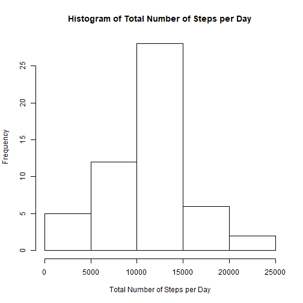
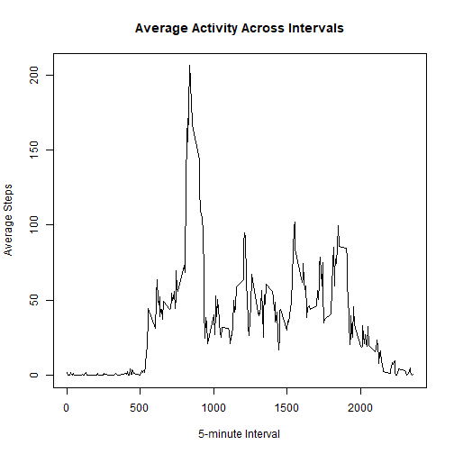
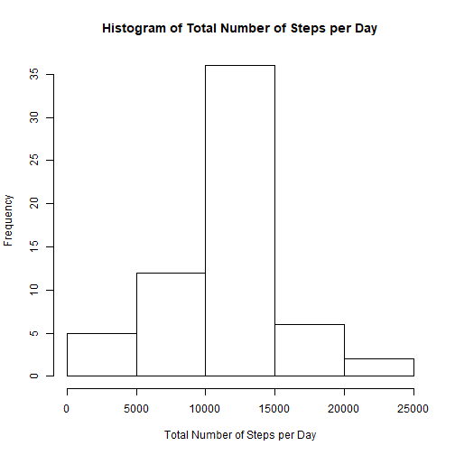
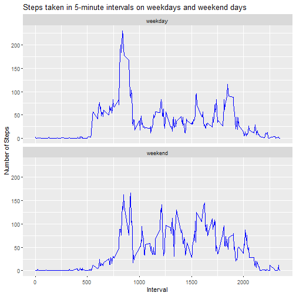

## Loading and preprocessing the data

```r
data<-read.csv("activity.csv")
library(dplyr)
library(stats)
library(ggplot2)
```

## What is mean total number of steps taken per day?

```r
activity<-data[complete.cases(data),]
total_steps<-aggregate(steps ~ date,activity,sum)
hist(total_steps$step, main="Histogram of Total Number of Steps per Day", xlab = "Total Number of Steps per Day")
```



```r
mean(total_steps$steps)
```

```
## [1] 10766.19
```

```r
median(total_steps$steps)
```

```
## [1] 10765
```

## What is the average daily activity pattern?

```r
avg_interval<- aggregate(steps ~ interval,activity,mean)
 plot(avg_interval$interval, avg_interval$step, type="l", main="Average Activity Across Intervals", xlab="5-minute Interval", ylab="Average Steps")
```



```r
 avg_interval[which.max(avg_interval$steps),]
```

```
##     interval    steps
## 104      835 206.1698
```


## Imputing missing values

```r
data_na<-data[is.na(data$steps),]
print(paste("Number of NAs is:", nrow(data_na)))
```

```
## [1] "Number of NAs is: 2304"
```

```r
data_na$steps<- avg_interval$steps
merge_data<-merge(activity,data_na,all=TRUE,sort=FALSE)
new_data<-merge_data[order(merge_data$date),]
new_total_steps<- aggregate(steps ~ date,new_data,sum)
 hist(new_total_steps$step, main="Histogram of Total Number of Steps per Day", xlab = "Total Number of Steps per Day")
```



```r
 mean(new_total_steps$steps)
```

```
## [1] 10766.19
```

```r
 median(new_total_steps$steps)
```

```
## [1] 10766.19
```
**The MEAN has not changed and the MEDIAN has increased by 1.**

**No significant impact on these values has been observed.**


## Are there differences in activity patterns between weekdays and weekends?


```r
 new_data$day<-as.factor(if_else(weekdays(as.Date(new_data$date))=="Saturday" | weekdays(as.Date(new_data$date))=="Sunday" ,"weekend","weekday"))
avg_interval_day <- aggregate(steps ~ interval + day, new_data, mean)
g <- ggplot(avg_interval_day, aes(interval, steps)) + geom_line(color = "blue")
 g <- g + labs(x = "Interval", y = "Number of Steps", title = "Steps taken in 5-minute intervals on weekdays and weekend days")
g <- g + facet_wrap(~day, nrow = 2)
print(g)
```




